# StackChan + Nanobot 架构设计说明

## 1. 目标与范围

本系统用于验证 AIBuddy 类家用陪伴设备的端云协同架构：设备本地运行轻量 RTOS 固件，负责音频采集、播放、屏幕、灯光、舵机、摄像头和本地应用；Bridge 运行在电脑、Windows、Linux 服务器或 Lightsail 上，负责协议适配、模型调度、Agent 会话和工具调用；Nanobot 作为 Agent Runtime，负责对话、上下文、模型调用和 Tool Call；模型层可以选择云端 GLM、本地模型，或后续扩展为混合调度。

当前实现重点是打通以下闭环：

- 语音唤醒和语音输入。
- ASR 转写。
- LLM 意图理解。
- Tool Call 调用 StackChan 本地能力。
- TTS 语音回复。
- 倒计时、秒表、专注模式、Todo、灯光、转头、跳舞等本地能力。
- 本机、Windows、Lightsail 等可迁移部署。

## 2. 总体架构

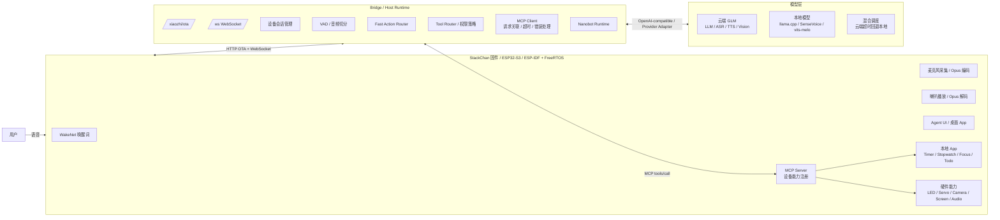

## 3. 分层设计

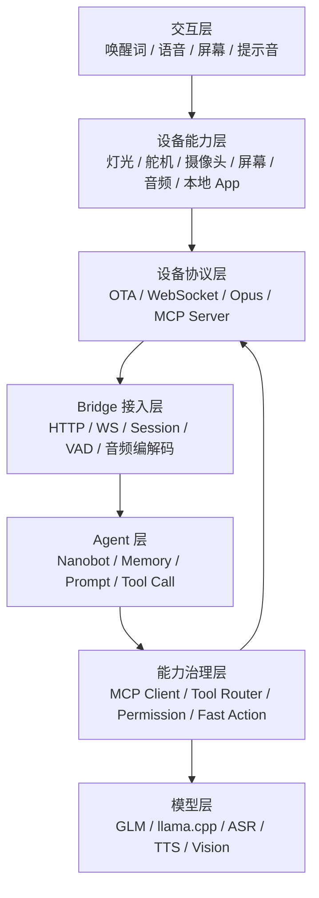

### 3.1 设备固件层

设备固件运行在 ESP32-S3 上，基于 ESP-IDF / FreeRTOS。它负责实时硬件控制和本地状态：

- 唤醒词检测：当前测试稳定路径是 WakeNet 唤醒词。
- 音频采集：设备把语音编码为 Opus，通过 WebSocket 发给 Bridge。
- 音频播放：Bridge 返回 TTS Opus 包，设备解码播放。
- UI：Agent 页面显示连接状态、识别结果、回复、错误、计时器角标等。
- 本地 App：Timer、Stopwatch、Focus、Todo。
- MCP Server：把设备能力以标准 MCP tools 形式暴露出去。

### 3.2 当前 StackChan 硬件参数

以下参数来自当前设备启动日志、固件分区表和板级配置。不同批次硬件如有差异，以实际串口日志为准。

| 项目 | 当前观测值 / 配置 |
| --- | --- |
| 设备 SKU | `m5stack-stack-chan` |
| 主控 | ESP32-S3 |
| 芯片版本 | revision `v0.2` |
| CPU | 双核，启动日志显示 `240 MHz` |
| 无线能力 | Wi-Fi / BLE |
| SPI Flash | `16 MB` |
| PSRAM | `8 MB`，80 MHz |
| 运行时可分配内部 RAM | 启动日志显示约 `180 KiB + 21 KiB + 32 KiB + 7 KiB` 分段可用，实际 Agent 运行中会随音频、Wi-Fi、LVGL、MCP 变化 |
| PSRAM 用途 | 作为 heap pool；显示图像缓存当前使用 `2 MB` PSRAM |
| 显示屏 | 320 x 240 LCD，ILI9342/ILI9341 驱动路径 |
| 触摸 | FT6336 |
| 摄像头 | GC0308，DVP 并口配置 |
| 音频输入 | ES7210，3 路麦克风输入路径，TDM |
| 音频输出 | AW88298 功放路径 |
| 设备音频采样率 | 固件配置输入/输出 `24000 Hz` |
| Bridge 音频通道 | WebSocket hello 中使用 Opus，`16000 Hz`，单声道，60 ms frame |
| PMIC | AXP2101 |
| IO 扩展 | AW9523 / PY32IOExpander |
| IMU | BMI270 |
| RTC | PCF8563 |
| 头部运动 | 双舵机，yaw / pitch |

当前固件分区表：

| 分区 | 类型 | Offset | Size | 用途 |
| --- | --- | --- | --- | --- |
| `nvs` | data/nvs | `0x9000` | `0x4000` | Wi-Fi、设置、本地状态 |
| `otadata` | data/ota | `0xd000` | `0x2000` | OTA 状态 |
| `phy_init` | data/phy | `0xf000` | `0x1000` | RF PHY 初始化 |
| `ota_0` | app/ota_0 | `0x20000` | `0x4f0000` | App A |
| `ota_1` | app/ota_1 | auto | `0x4f0000` | App B |
| `assets` | data/spiffs | `0xA00000` | `5 MB` | 资源、图片、声音等 |
| `coredump` | data/coredump | auto | `0x10000` | panic 后 core dump，64 KB |

当前固件构建后的应用大小约 `3.6-4.4 MB`，小于单个 OTA app 分区 `0x4f0000`，仍有约 20% 以上余量。资源分区当前为 `5 MB`，用于固件内置资源和本地提示音。

这些约束决定了设备侧职责边界：

- ESP32-S3 适合运行 WakeNet、VAD、音频编解码、硬件控制、本地状态机和轻量 App。
- 不适合运行 Nanobot、通用 LLM、通用 ASR/TTS 大模型或复杂 Tool Router。
- 因此 Bridge 必须存在，运行在电脑、边缘盒子、NAS、服务器或云主机上。
- 设备本地能力通过 MCP 暴露，模型推理和 Agent loop 放在 Bridge/Nanobot 侧。

### 3.3 Bridge 层

Bridge 运行在外部主机上，可以是 Linux 本机、Windows、WSL、Lightsail 或其它服务器。它不是简单代理，而是设备云端接入层：

- 提供 `/xiaozhi/ota/`，返回 WebSocket 地址、认证信息和协议配置。
- 提供 `/ws`，维护 StackChan 长连接。
- 管理设备 session、重连、断线和多轮上下文 key。
- 接收 Opus 音频，做 VAD endpoint 检测。
- 调用 ASR，把音频转文字。
- 把文本交给 Nanobot。
- 调用 TTS，把 Nanobot 回复转成设备可播放音频。
- 作为 MCP Client 发现 StackChan 本地 tools。
- 实现 Tool Router、权限分级和 Fast Action。

### 3.4 Nanobot 层

Nanobot 是当前系统的 Agent Runtime，负责真正的 Agent 闭环：

- 维护多轮对话上下文。
- 构建 system prompt 和工具上下文。
- 调用 LLM。
- 解析模型的 tool call。
- 执行 MCP tools。
- 把 tool result 回填给模型。
- 生成最终自然语言回复。

设计原则是：Bridge 不绕过 Nanobot 实现完整模型工具循环。Bridge 可以做低延迟 fast action，但需要保持 Nanobot 仍然是主要 Agent 后端。

### 3.5 模型层

当前支持两类模型路径。

云端 GLM：

| 能力 | 模型 |
| --- | --- |
| Chat / LLM | `glm-4.7-flash` |
| ASR | `glm-asr-2512` |
| TTS | `glm-tts` |
| Vision | `glm-4.6v-flash` |

本地模型：

| 能力 | 推理框架 | 模型 |
| --- | --- | --- |
| LLM | `llama.cpp` / `llama-server` | `Qwen3-4B-Q4_K_M.gguf` |
| ASR | local speech service | `SenseVoiceSmall` |
| TTS | local speech service | `vits-melo-tts-zh_en` |

本地 LLM 通过 OpenAI-compatible HTTP 接口接入：

```text
http://127.0.0.1:18080/v1
```

本地 ASR/TTS 通过本地 speech service 接入：

```text
http://127.0.0.1:18081/v1
```

## 4. 部署形态

### 4.1 本机局域网

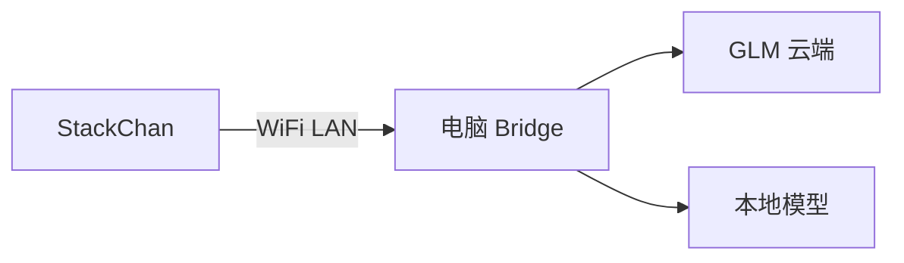

适合开发调试，延迟最低，便于串口诊断和刷机。

### 4.2 Windows 主机

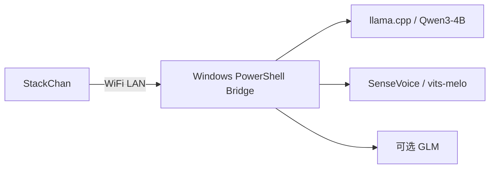

Windows 脚本负责本地模型拉取、llama.cpp 构建、本地 ASR/TTS 服务启动和 Bridge 启停。

### 4.3 Lightsail / 公网服务器


推荐最小可行方案是 Bridge 放 Lightsail，模型仍走 GLM 云端。低配 Lightsail 不建议跑本地 LLM。

公网部署时不能使用 `stackchan-nanobot.local`，需要使用公网 IP 或域名：

```text
http://<public-host>:12800/xiaozhi/ota/
ws://<public-host>:12800/ws
```

生产形态建议用 `443` 反代：

```text
https://<domain>/xiaozhi/ota/
wss://<domain>/ws
```

## 5. 设备连接与启动时序

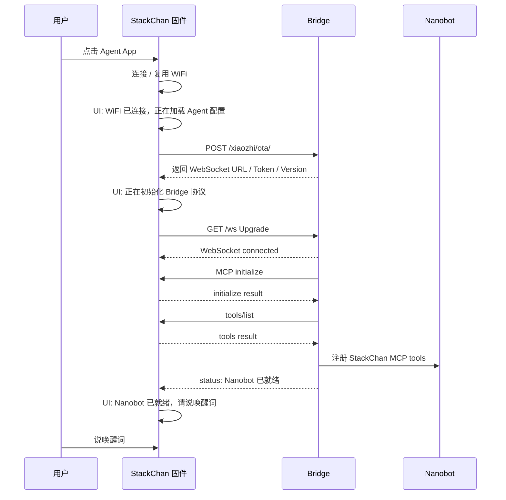

当前设计中，进入 Agent 页面后 Bridge 会预连接。用户应等待屏幕出现 `Nanobot 已就绪，请说唤醒词` 后再开始唤醒和对话。

## 6. MCP 能力注册机制

StackChan 固件侧维护 MCP Server。每个本地能力会被注册为 tool，例如：

```text
self.timer.start
self.timer.list
self.stopwatch.start
self.focus.start
self.todo.add
self.robot.set_head_angles
self.robot.set_led_color
self.robot.dance
self.audio_speaker.set_volume
self.screen.set_brightness
```

注册流程：

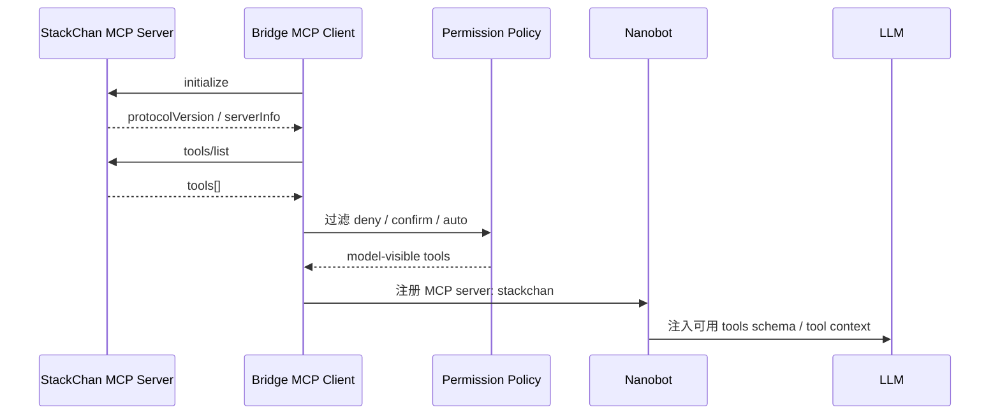

Bridge 会根据权限策略处理工具：

| 权限 | 行为 | 示例 |
| --- | --- | --- |
| `auto` | 可自动执行 | 灯光、转头、计时器、Todo |
| `confirm` | 需要用户确认 | 摄像头拍照 |
| `deny` | 默认禁止暴露或执行 | 重启、升级、网络配置 |

## 7. Tool Call 执行链路

完整 LLM Tool Call 链路：

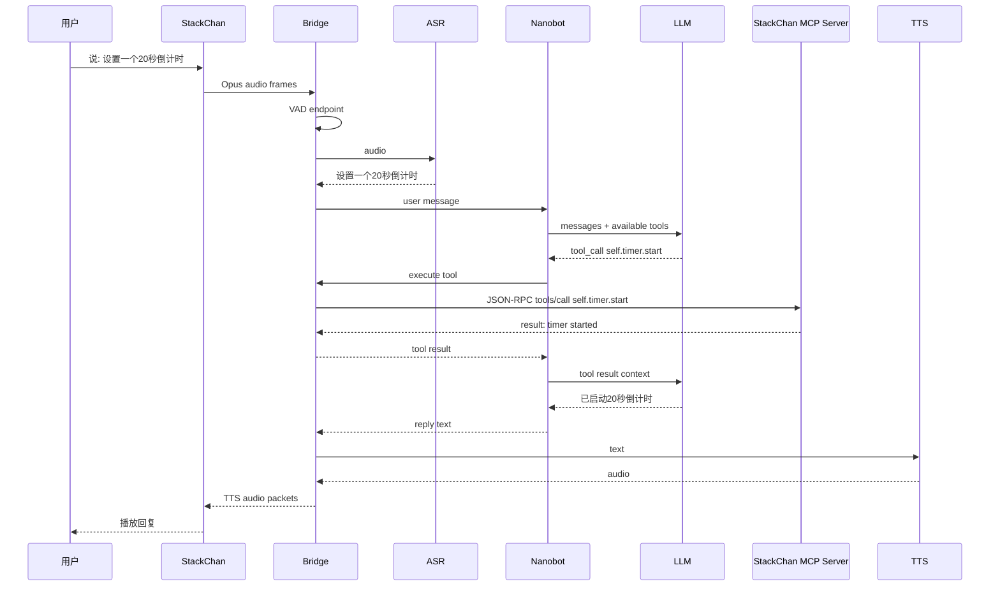

## 8. Fast Action 执行链路

为降低延迟，Bridge 对高频、低风险、结构明确的指令实现了 fast action。命中后不进入完整 LLM loop，而是直接调用 MCP。

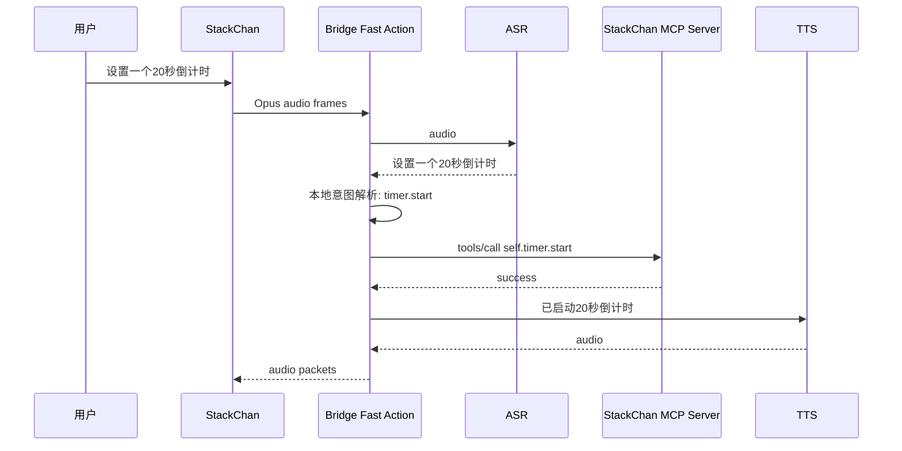

Fast action 当前适合：

- 倒计时。
- 秒表。
- 专注模式。
- Todo 添加、查询、删除、清空。
- 灯光颜色。
- 头部左右/上下相对角度。
- 简单跳舞动作。

## 9. 本地能力暴露方式

设备本地能力分为两类。

### 9.1 硬件能力

```text
LED
Servo head yaw / pitch
Screen brightness / theme
Speaker volume
Camera photo
System info
```

这些能力直接由固件驱动硬件，Bridge 通过 MCP 调用。

### 9.2 本地 App 能力

```text
Timer
Stopwatch
Focus Mode
Todo
Reminder legacy tools
```

这些能力的状态在设备本地维护。Timer 这类能力需要和 RTC / NVS 配合，保证重启后能够恢复或诊断。

本地 App 的设计原则：

- UI 层提供桌面入口和状态展示。
- 业务状态保存在固件本地。
- MCP 层暴露标准工具。
- Bridge 层只做调用和权限控制，不复制设备状态为唯一来源。

## 10. 模型模式

### 10.1 云端模式

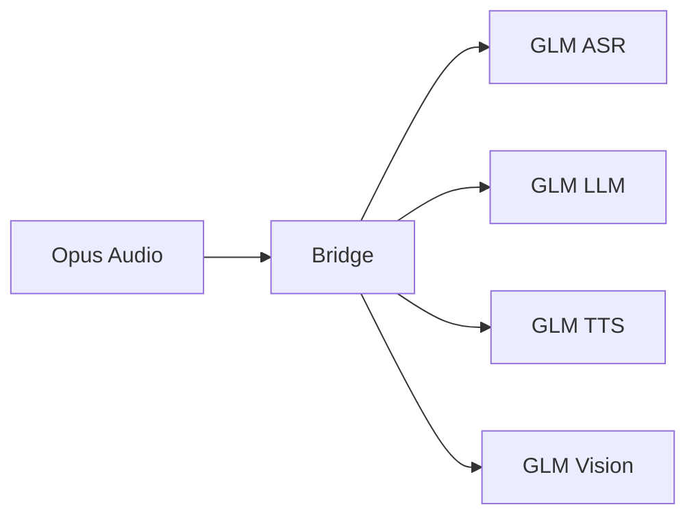

优点：

- 模型质量较好。
- 不吃本机算力。
- Lightsail 低配服务器也能运行 Bridge。

风险：

- 依赖公网和供应商稳定性。
- 可能出现 GLM `1305` 模型繁忙。
- 延迟不可完全控制。

### 10.2 本地模式

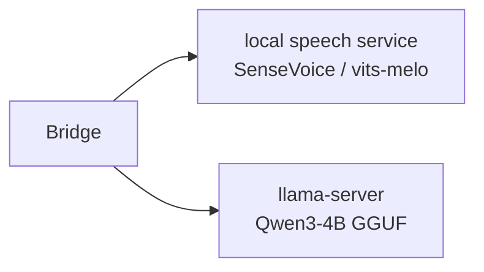

优点：

- 不依赖云端模型服务。
- 数据留在本地。
- ASR/TTS 可独立调优。

风险：

- CPU 推理延迟较高。
- 本地小模型 tool call 稳定性弱于云端大模型。
- TTS 播放完整性和流式体验需要继续优化。
- 低配服务器不适合运行本地 LLM。

### 10.3 混合模式

混合模式的目标是：

```text
优先云端 -> 超时 / 错误 -> 回退本地
```

当前设计上保留了 provider fallback 的扩展点，但优先级低于稳定本机闭环。混合模式需要明确每类能力的超时时间、回退策略和用户提示，否则容易导致交互延迟不可预测。

## 11. 安全与权限

安全策略由 Bridge 统一控制：

- API Key 只从 env 读取，不写入仓库和日志。
- `12801` MCP 端口只用于本地访问，不应公网开放。
- 本地模型端口 `18080/18081` 不应公网开放。
- 高风险工具默认 deny 或 confirm。
- 摄像头类工具需要用户确认。
- 重启、升级、网络配置默认禁止暴露给 LLM。

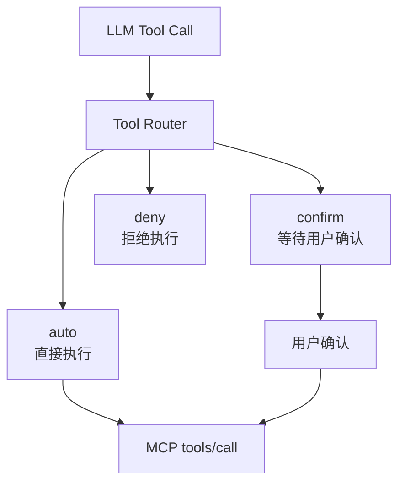

## 12. 关键运行信号

| 信号 | 含义 |
| --- | --- |
| `Bridge 已连接，正在加载设备能力` | WebSocket 已连上，正在 MCP initialize/tools/list |
| `Nanobot 已就绪，请说唤醒词` | Bridge、MCP、Nanobot 已可用 |
| `Bridge 正在连接，请稍等...` | 用户过早说唤醒词，Bridge 仍在预连接 |
| `Bridge 连接失败，请检查电脑端服务` | OTA 或 WebSocket/MCP 初始化失败 |
| Bridge log: `[mcp] discovered tools=...` | 设备 tools/list 成功 |
| Bridge log: `[fast-action] ...` | 命中低延迟本地动作 |
| Bridge log: `[nanobot] complete ...` | Nanobot 完成一轮回复 |

## 13. 代码位置

| 模块 | 位置 |
| --- | --- |
| Bridge 主服务 | `nanobot_bridge/server.py` |
| 能力选择与策略 | `nanobot_bridge/capabilities.py` |
| 云端 GLM ASR/TTS/Vision adapter | `scripts/stackchan_asr_glm.py`, `scripts/stackchan_tts_glm.py`, `scripts/stackchan_vision_glm.py` |
| OpenAI-compatible 本地 adapter | `scripts/stackchan_asr_openai.py`, `scripts/stackchan_tts_openai.py`, `scripts/stackchan_vision_openai.py` |
| 本地 speech service | `local_inference/speech_service.py` |
| Linux 启动脚本 | `scripts/start_stackchan_nanobot_hotspot.sh` |
| Windows 启动脚本 | `scripts/start_stackchan_nanobot_windows.ps1` |
| Windows 本地模型准备 | `scripts/setup_stackchan_local_inference_windows.ps1` |
| 固件源码 | `StackChan/firmware/` |
| 固件 xiaozhi patch | `StackChan/firmware/patches/xiaozhi-esp32.patch` |
| 操作手册 | `docs/stackchan-operations-runbook.md` |

## 14. 当前限制与后续优化

当前已打通基本闭环，但仍有以下限制：

- 本地 LLM 在 CPU 上响应慢，复杂 tool call 稳定性不足。
- TTS 完整播放和打断策略仍需继续优化。
- 摄像头 Vision 的超时、确认和回退体验需要加强。
- 公网部署建议补充 HTTPS/WSS 反代。
- 唤醒词依赖固件内已有 WakeNet 模型，不能仅靠配置任意切换。
- 多设备场景需要进一步完善设备身份、租户隔离和权限策略。

后续建议优先级：

1. 稳定设备端 Agent 页面状态机和音频播放。
2. 收敛 fast action 覆盖范围，保证家居陪伴类高频指令低延迟。
3. 引入 HTTPS/WSS 部署模板。
4. 为 Lightsail 和 Windows 分别提供一键健康检查。
5. 评估更强本地 LLM 或 GPU/iGPU 推理路径。
